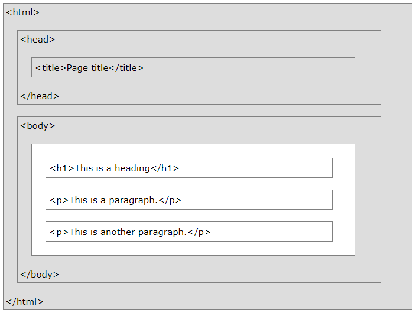
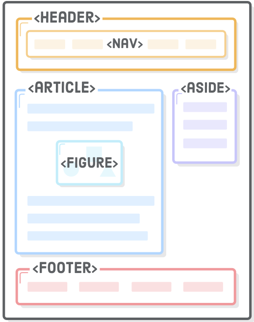
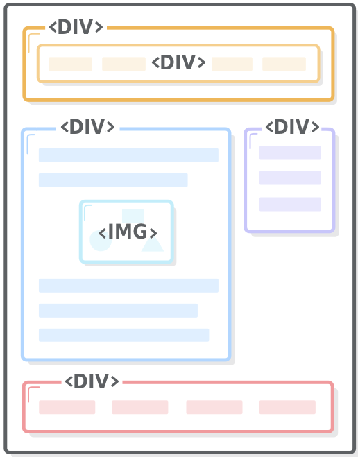

# HTML

## What is HTML?
HTML is the standard markup language for creating Web pages.

- HTML stands for Hyper Text Markup Language;
- HTML describes the structure of Web pages using XML markup;
- HTML elements are the building blocks of HTML pages;
- HTML elements are represented by tags.

There is many historical revisions of HTML standard, but we will focus on latest and actual HTML5 specification.

Version	 | Year
---------|-----
HTML     | 1991
HTML 2.0 | 1995
HTML 3.2 | 1997
HTML 4.01| 1999
XHTML    | 2000
**HTML5**| 2014

Let's take a look at simple example of HTML element

```html
<article>My First HTML Element</article>
```
HTML tags label pieces of content such as "heading", "paragraph", "table", and so on
Browsers do not display the HTML tags, but use them to render the content of the page

HTML tags normally come in pairs like `<p>` and `</p>`
The first tag in a pair is the start (opening) tag, the second tag is the end (closing) tag

## Web page structure

Elements is base building blocks of HTML document, displayed by web browsers.
Elements could be nested and therefore form hierarchical structure. This structure reflects semantic and visual representation of document.

```html
<!DOCTYPE html>
<html>
  <head>
    <title>Page Title</title>
  </head>
  <body>
    <h1>My First Heading</h1>
    <p>My first paragraph.</p>
  </body>
</html>
```

* The `<!DOCTYPE html>` declaration defines this document to be HTML5 (special case of non-self-closing single tag)
* The `<html>` element is the root element of an HTML page
* The `<head>` element contains meta information about the document
* The `<title>` element specifies a title for the document
* The `<body>` element contains the visible page content
* The `<h1>` element defines a large heading
* The `<p>` element defines a paragraph


*Result*


## HTML page semantics

Below is a visualization of an HTML page structure:



> Note: Only the content inside the `<body>` section (the white area above) is displayed in a browser.

Keep in mind: HTML at first represents semantic srtucture of document, not it's appearance. 
"Semantic HTML" refers to the idea that all your HTML markup should convey the underlying meaning of your content.

Using semantic markup is an important aspect of modern web development because it makes it easier for search engines, screen readers, and other machines to identify the different parts of your website. 
It also helps you as a developer keep your site organized, which, in turn, makes it easier to maintain.



*Here is correct semantic HTML markup*





*And it's evil twin - non-semantic markup*

-------
### Soucres:
* [W3School HTML Introduction](https://www.w3schools.com/htmL/html_intro.asp)
* [Semantic HTML](https://internetingishard.com/html-and-css/semantic-html/)
