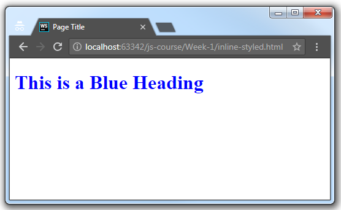
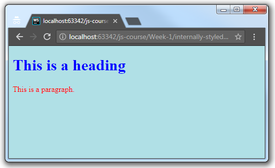

# HTML

## What is HTML?
HTML is the standard markup language for creating Web pages.

- HTML stands for Hyper Text Markup Language;
- HTML describes the structure of Web pages using XML markup;
- HTML elements are the building blocks of HTML pages;
- HTML elements are represented by tags.

There is many historical revisions of HTML standard, but we will focus on latest and actual HTML5 specification.

Version	 | Year
---------|-----
HTML     | 1991
HTML 2.0 | 1995
HTML 3.2 | 1997
HTML 4.01| 1999
XHTML    | 2000
**HTML5**| 2014

Let's take a look at simple example of HTML element:

```html
<article>My First HTML Element</article>
```
HTML tags label pieces of content such as "heading", "paragraph", "table", and so on.
Browsers do not display the HTML tags, but use them to render the content of the page

HTML tags normally come in pairs like `<p>` and `</p>`.
The first tag in a pair is the start (opening) tag, the second tag is the end (closing) tag.

## Web page structure

Elements is base building blocks of HTML document, displayed by web browsers.
Elements could be nested and therefore form hierarchical structure. This structure reflects semantic and visual representation of document.

```html
<!DOCTYPE html>
<html>
  <head>
    <title>Page Title</title>
  </head>
  <body>
    <h1>My First Heading</h1>
    <p>My first paragraph.</p>
  </body>
</html>
```

* The `<!DOCTYPE html>` declaration defines this document to be HTML5 (special case of non-self-closing single tag);
* The `<html>` element is the root element of an HTML page;
* The `<head>` element contains meta information about the document;
* The `<title>` element specifies a title for the document;
* The `<body>` element contains the visible page content;
* The `<h1>` element defines a large heading;
* The `<p>` element defines a paragraph.

Let's save our web page markup as `index.html` file and open it in Google Chrome browser:


*Result*


## HTML page semantics

Below is a visualization of our HTML page structure:


> Note: Only the content inside the `<body>` section (the white area above) is displayed in a browser.

Keep in mind: HTML at first represents semantic srtucture of document, not it's appearance. 
"Semantic HTML" refers to the idea that all your HTML markup should convey the underlying meaning of your content.

Using semantic markup is an important aspect of modern web development because it makes it easier for search engines, screen readers, and other machines to identify the different parts of your website. 
It also helps you as a developer keep your site organized, which, in turn, makes it easier to maintain.

*Here is correct semantic HTML markup*:


 *And it's evil twin - non-semantic markup*:


 Semantic web is one of the most popular job interview topic.
You can learn more about this at [Semantic HTML article](https://internetingishard.com/html-and-css/semantic-html).

## Write HTML

Within the course we recommend using professional IDE like WebStorm, IntelliJ IDEA, Atom or VS Code,
but it's OK to use lightweight text editors in such simple cases like above.
Essential requirement for HTML text editor are HTML syntax highlight and UTF-8 support.


Files, containing HTML, have `.html` or `.htm` extension.
A common filename for web application entry point is `index.html`.
When browser requests a URL that points to a directory structure instead of an actual web page, web server will generally serve this default (index) page.

For example, if you'll open in your browser URL like `http://localhost/`, web server will give you content of `index.html` file, located in your web server root directory,
so content of this page will be equivalent to `http://localhost/index.html`.

Last thing about html files: we recommend using UTF-8 encoding when saving files.
This charset is universal way to code and maintain multilingual applications without headache about web server configuration and third-party libs interoperability.

## HTML Document

As we saw before, all HTML documents must start with a document type declaration: `<!DOCTYPE html>`.

The HTML document itself begins with `<html>` and ends with `</html>`.

The `<head>` section contains meta information about page and additional non-visualizable data.
Some of useful tags within head tag includes `<meta>`, `<script>`, `<style>` and `<title>`.

The visible part of the HTML document is between `<body>` and `</body>`.
There is various amount of "presentational" tags, which could be used inside of body.

Some of them: `<span>`, ``, `<table>`, `<video>`, `<input>`, `<button>`.

Full list of avaliable HTML tags could be found at [W3School HTML Element Reference page](https://www.w3schools.com/tags/ref_byfunc.asp).

## Into elements

An HTML element usually consists of a start tag and end tag, with the content inserted in between:

```html
  <tagname>Content goes here...</tagname>
```

The HTML element is everything from the start tag to the end tag:
```
  <p>My first paragraph.</p>
```

Start tag | Element content     | End tag
----------|---------------------|--------
`<h1>`    | My First Heading    | `</h1>`
`<p>`     | My first paragraph. | `</p>`
`<br>`    |                     |

> HTML elements with no content are called empty elements. Empty elements do not have an end tag, such as the <br> element (which indicates a line break).
  
### Nested HTML Elements
HTML elements can be nested (elements can contain elements).
    
All HTML documents consist of nested HTML elements.
    
This example contains four HTML elements:

```html
<!DOCTYPE html>
<html>
  <body>

  <h1>My First Heading</h1>
  <hr />
  <p>My first paragraph.</p>

  </body>
</html>
```

* The `<html>` element defines the whole document.
It has a start tag `<html>` and an end tag `</html>`.

* The element content is another HTML element (the `<body>` element).
The `<body>` element defines the document body.
It has a start tag `<body>` and an end tag `</body>`.

* The element content is two other HTML elements (`<h1>` and `<p>`).

* The `<h1>` element defines a heading.
It has a start tag `<h1>` and an end tag `</h1>`.
The element content is: `My First Heading`.

* The element `<hr />` represents horizontal ruler and have no contend (it's just a horizontal divider). 

* The `<p>` element defines a paragraph.
It has a start tag `<p>` and an end tag `</p>`.
The element content is: `My first paragraph`.

### Use Lowercase Tags
HTML tags are not case sensitive: `<P>` means the same as `<p>`, **but** we recommends lowercase in HTML. Moreover, later React JavaScript library syntax will make us to use lowercase for standard in-browser tags anyway.


### HTML Comments
One more thing about HTML is comments. Comments embeds in document like so:
```html
  <!-- This is a comment -->
  <p>This is a paragraph.</p>
  <!-- Remember to add more information here -->
```

> Comments are not displayed by the browser, but they can help document your HTML source code. Comments stay intact in web page source code.

## HTML Attributes

Attributes provide additional information about HTML elements.

* All HTML elements can have attributes
* Attributes provide additional information about an element
* Attributes are always specified in the start tag
* Attributes usually come in name/value pairs like: name="value"

Example:
HTML links are defined with the `<a>` tag. The link address is specified in the href attribute:
```html
  <a href="https://www.google.com">This is a link</a>
```

One more example:
HTML images are defined with the `` tag. The filename of the image source is specified in the src attribute:
```html
  
```

Styling with attributes:
The style attribute is used to specify the styling of an element, like color, font, size etc.:
```html
  <p style="color:red;">I am a red paragraph</p>
```
> We will learn more about CSS later in this course.


**Summary**: Each tag have it's own attributes. Some of them are optinal (like `style`), some are mandatory (like `src` on `` tag). Attributes allow specify element representation and behaviour.

Detailed attributes reference could be found at [W3School HTML Attribute Reference](https://www.w3schools.com/tags/ref_attributes.asp) page.


## Styling with CSS
CSS stands for Cascading Style Sheets. It describes how HTML elements are to be displayed on screen, paper, or in other media.

CSS can be added to HTML elements in 3 ways:

* **Inline** - by using the style attribute in HTML elements
* **Internal** - by using a `<style>` element in the `<head>` section
* **External** - by using an external CSS file

The most common way to add CSS, is to keep the styles in separate CSS files. However, here we will use inline and internal styling, because this is easier to demonstrate, and easier for you to try it yourself.

### Inline CSS
An inline CSS is used to apply a unique style to a single HTML element with use of `style` attribute of an HTML element:
```html
  <h1 style="color:blue;">This is a Blue Heading</h1>
```




### Internal CSS
An internal CSS is used to define a style for a single HTML page and defined in the `<head>` section of an HTML page, within a `<style>` element:

```html
<!DOCTYPE html>
<html>
  <head>
    <style>
      body {background-color: powderblue;}
      h1   {color: blue;}
      p    {color: red;}
    </style>
  </head>
  <body>
    <h1>This is a heading</h1>
    <p>This is a paragraph.</p>
  </body>
</html>
```




### External CSS
An external style sheet is used to define the style for many HTML pages.

To use an external style sheet we should add a link to it in the `<head>` section of the HTML page:

```html
<!DOCTYPE html>
<html>
  <head>
  
    <link rel="stylesheet" href="styles.css">
	
  </head>
  <body>
    <h1>This is a heading</h1>
    <p>This is a paragraph.</p>
  </body>
</html>
```

An external style sheet can be written in any text editor. The file must not contain any HTML code, and must be saved with a `.css` extension.

Here is how the `styles.css` looks:

```css
body {
  background-color: powderblue;
}
h1 {
  color: blue;
}
p {
  color: red;
}
```

Result of this case is identical to Internal CSS example.

### The id Attribute
To define a specific style for one special element, add an id attribute to the element:

```html
<p id="p01">I am different</p>
```

then define a style for the element with the specific id:

```css
#p01 {
  color: blue;
}
```


### The class Attribute
To define a style for special types of elements, add a class attribute to the element:

```html
  <p class="error">I am different</p>
```
then define a style for the elements with the specific class:

```css
p.error {
  color: red;
}
```

or more generally 
```css
.error {
  color: red;
}
```

> We recommend prefer class attributes over element or id css selectors. 


### Selectors
**Note**: here in Internal and External CSS examples we use `selectors` syntax, which allows us to apply certain styling rules like `color` on multiple elements. To specify which elements should receive the rule in this example we specify tags, which will be used as filtering rule. E.g.: `h1   {color: blue;}` rule will select all `h1` elements on the page and make them blue. 

Besides `tag`/`element` selectors there is also `class` selectors, `id` selectors, `attribute` selectors and their combinations. For further reading and detailed explanation about selectors please take a note at [CSS Selector Reference](https://www.w3schools.com/cssref/css_selectors.asp) and [CSS Syntax and Selectors](https://www.w3schools.com/css/css_syntax.asp) guide.

Insights and ideas on webpage elements hierarchy, semantic layout and styling could be found in [BEM methodology](https://en.bem.info/methodology/quick-start/)


## HTML JavaScript

JavaScript makes HTML pages more dynamic and interactive.

The `<script>` tag is used to define a client-side script (JavaScript).

The `<script>` element either contains scripting statements, or it points to an external script file through the src attribute.


// TBD


-------

### Soucres:
* [W3School HTML Introduction](https://www.w3schools.com/htmL/html_intro.asp)
* [Semantic HTML](https://internetingishard.com/html-and-css/semantic-html/)


