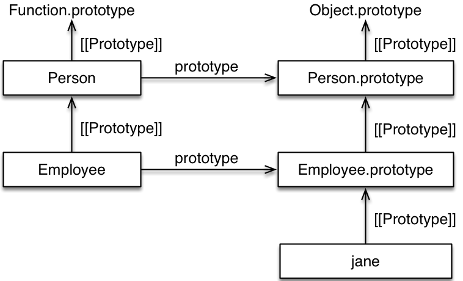
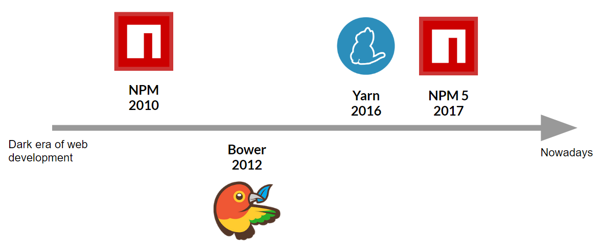
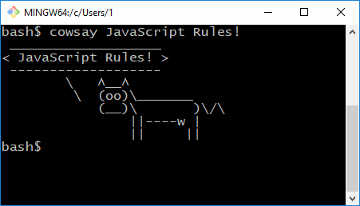
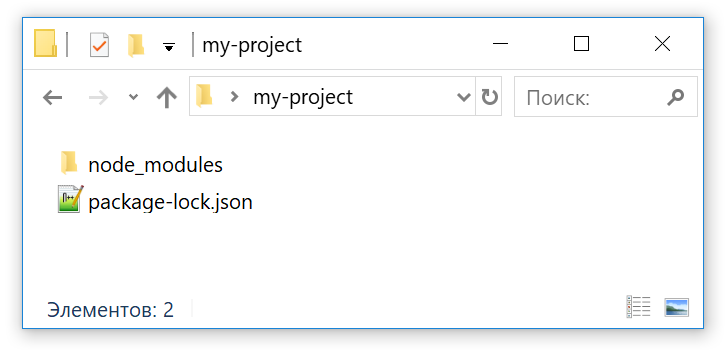
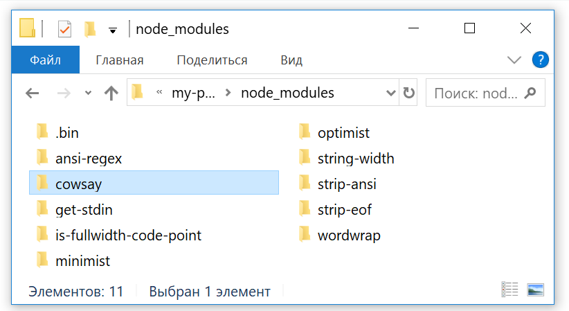
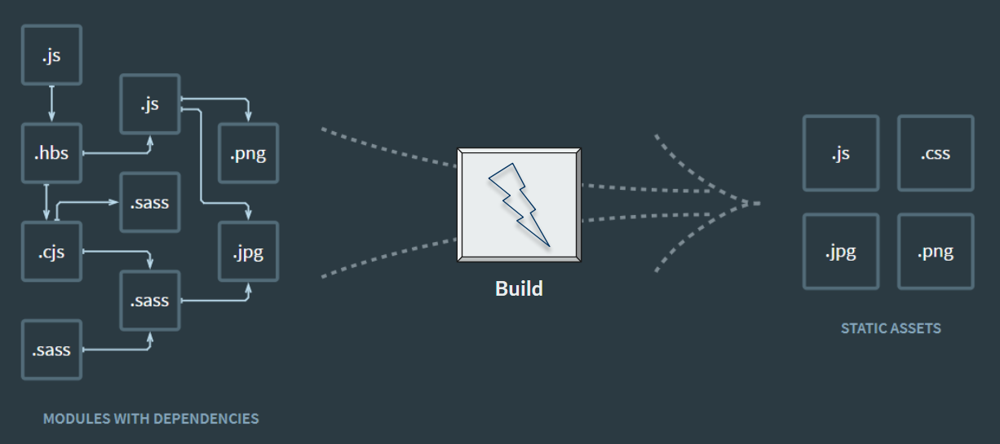
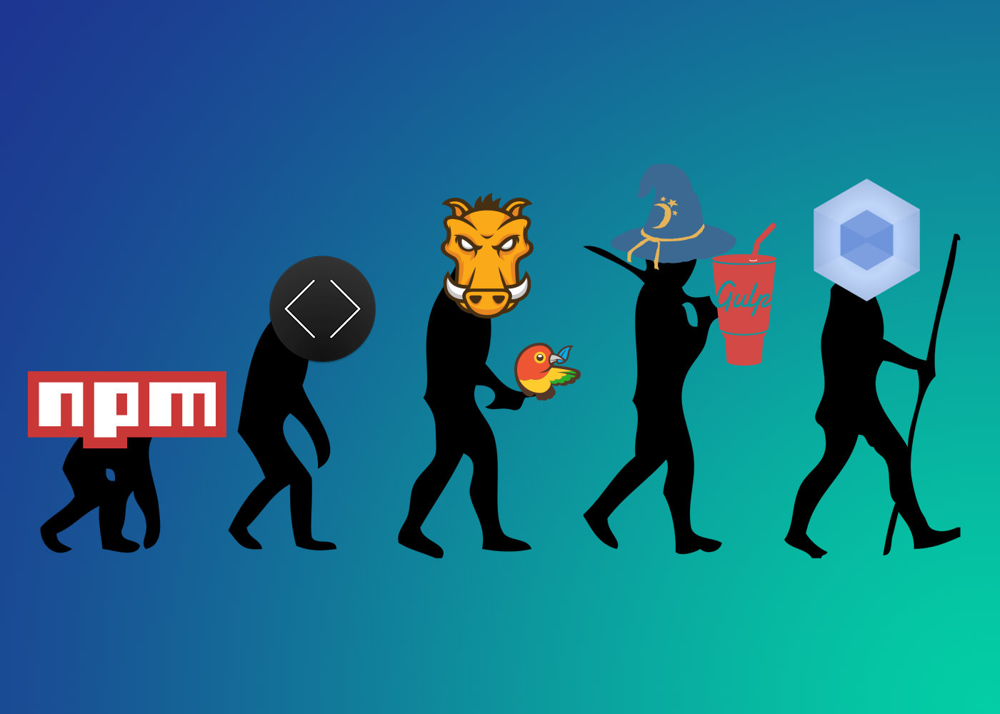
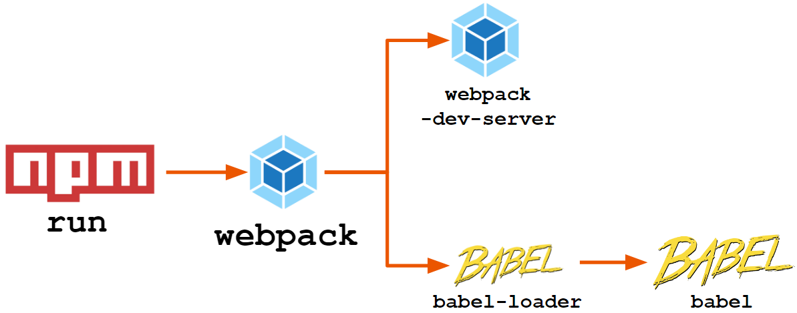

## Prototype Inheritance

### `this` keyword
In a function definition, `this` refers to the "owner" of the function.

```javascript
var person = {
   firstName: "John",
   lastName : "Doe",
   id       : 5566,
   fullName : function() {
       return this.firstName + " " + this.lastName;
   }
};
```

* When used alone, `this` refers to the Global object (`window`).
* When used in a function, `this` also refers to the Global object (In strict mode, this will be `undefined`)
* In object definition context (earlier examples), this is the “owner” object reference

The `call()` and `apply()` methods can be used to call an object method with another object as argument.


```javascript
var person1 = {
   fullName: function() {
       return this.firstName + " " + this.lastName;
   }
};

var person2 = {
   firstName:"John",
   lastName: "Doe",
};

person1.fullName.call(person2);  // Will return "John Doe"
```

### Constructors
Sometimes we need a "blueprint" for creating many objects of the same "type".
The way to create an "object type", is to use an object constructor function with a `new` keyword.

```javascript
function Person(first, last, age) {
   this.firstName = first;
   this.lastName = last;
   this.age = age;
}
var myFather = new Person("John", "Doe", 50);
var myMother = new Person("Sally", "Rally", 48);
```


> Execution context is the value of this which is a reference to the object that owns the current executing code.
> Additional readings about edge cases of context creation recommended.

### Inheritance

Though JavaScript have **objects**, there is no **classes** in “vanilla” JavaScript. But nevertheless it is possible to adopt object-oriented style with JavaScript with help of **prototype inheritance**.

All JavaScript objects inherit properties and methods from a prototype.

Date objects inherit from `Date.prototype`. Array objects inherit from `Array.prototype`. Person objects inherit from `Person.prototype`.
The `Object.prototype` is on the top of the prototype inheritance chain:

Date objects, Array objects, and Person objects inherit from `Object.prototype`.



_Prototypes chain example_

> Prototype inheritance is widely used in large JavaScript application (at least under the hood of modern toolkits)


## Classes
JavaScript classes, introduced in ECMAScript 2015, are primarily syntactical sugar over JavaScript's existing prototype-based inheritance.

The class syntax does not introduce a new object-oriented inheritance model to JavaScript.

One way to define a class is using a class declaration. To declare a class, you use the `class` keyword with the name of the class (`constructor` is a special method for initializing an object created with a class):

```javascript
class Rectangle {
 constructor(height, width) {
   this.height = height;
   this.width = width;
 }
}
```

Let's add some methods:

```javascript
class Rectangle {
 constructor(height, width) {
   this.height = height;
   this.width = width;
 }

 calcArea() { // method
   return this.height * this.width;
 }
}

const square = new Rectangle(10, 10);
console.log(square.calcArea());
```

And getters:
```javascript
class Rectangle {

 ...

 get area() {  // getter
   return this.calcArea();
 }
}

const square = new Rectangle(10, 10);
console.log(square.area);
```

Methods could be static (with no access to `this` property):
```javascript
class Rectangle {
 ...

 static isSquare(height, width) {
   return height === width; // no access to `this`
 }
}
```


There is no such thing as class fields in actual EcmaScript standards, but there is proposals for it:
```javascript
class Car {
 hasWheels = true;
 color;
 static driveable = true;
}
```

### Class inheritance
```javascript
class Animal {
 constructor(name) {
   this.name = name;
 }

 speak() {
   alert(this.name + ' squeaks');
 }
}


class Dog extends Animal {
 constructor(name) {
   super(name);
 }

 speak() {
   alert(this.name + ' barks.');
 }
}


(new Dog('Bobik')).speak();// Bobik barks.
```


## Modules

Historically there is three main concepts about module systems in JavaScript:


### 1. AMD: Asynchronous module definition

The oldest specification. Could run in non-transpilled environment. Currently obsolete.

Examples: RequireJS, Dojo

```javascript
requirejs.config({
   paths: { app: 'src' }
});

// Requires src/main.js file
requirejs(['app/main'], function(main) {
   main(); // Use exported `main` variable here
});
```
_index.js_


```javascript
define(function (require) {
   return function() {
       alert('Hello!');
   }
});
```
_src/main.js_


### 2. CommonJS: Hello from Node.js

Synchronous module import specification used primarily in node.js environment
```javascript
var main = require('./src/main');

main();
```
_index.js_


```javascript
var msg = function() {
   alert('Hello!');
}

module.exports = msg;
```
_src/main.js_


### 3. ES6 modules: Part of modern language specs

“EcmaScript 6 modules” is part of modern JavaScript standards specifications widely used in pre-transpiled client-side JS.

```javascript
import { main } from './src/main';

main();
```
_index.js_

```javascript
export const main = () => {
   alert('Hello!');
}
```
_src/main.js_


### Module requesting strategies
* Request and cache each module via HTTP in runtime - dramatically reduces initial app size and loading time, application became unresponsive
* Statically analyze all imports in codebase and concatenate modules into one big bundle - single HTTP request on application startup, costs increased initial app size and loading time
* Hybrid - split your application into separate chunks, each containing bundled together modules


# Package management


_History of JavaScript package managers_


### npm

`npm` is a command line tool to help you manage packages from global npm registry (npmjs.com)

npm could install those packages on your machine:

* globally - they will be available all over your system
* or locally - available only in the context of your project (or directory)


Let's try to install a package with `npm` globally:
```sh
npm install -g cowsay
```

and then just run it:



_execution result_


If we'll try to install it locally (without `-g` flag), we will get this:


```sh
npm install cowsay

npm WARN: no such file or directory, open 'my-project\package.json'
npm notice created a lockfile as package-lock.json.
You should commit this file.
npm WARN: no such file or directory, open 'my-project\package.json'
npm WARN my-project No description
npm WARN my-project No repository field.
npm WARN my-project No README data
npm WARN my-project No license field.

+ cowsay@1.3.1
added 10 packages in 1.146s
```



_directory content_


As you can see, npm created a lock file (`package-lock.json`), containing your requirements snapshot.

Installed package could have his own requirements - some other packages, on which it relies.
And that packages could have their own, and etc, ant etc...

All this requirements tree is stored in this lock-file and being used each time we run `npm install` in directory, containing `package-lock.json`.
This file is not intended to edit this file manually.


Other result of `npm install` is `node_modules` directory, which contains all the required packages and their dependencies:



_node_modules directory content_


## package.json

Is used to manage locally installed npm packages.

`package.json` file:
* lists the packages that your project depends on.
* allows you to specify the versions of a package that your project can use using semantic versioning rules.
* makes your build reproducible, and therefore much easier to share with other developers.

```javascript
{
  "name": "my_awesome_project",
  "description": "Data visualization and analysis web client",
  "version": "1.0.0",
  "devDependencies": {
     "cowsay": "1.3.1"
  }
}
```
_simple minimal package.json_

With `package.json` in your project directory you could just run:
```sh
npm install
```

or even

```sh
npm i
```

to install all packages on which your project rely.


### Semantic versioning

Every project in npm registry have one or more versions.

Version numbers are conforms semantic versioning. Examples:
* `react@16.3.2`
* `lodash@0.5.0-rc.1`
* `my-awesome-lib@1.0.0-beta`

What does each version number means and how to use it in own product development?

Given a version number `MAJOR`.`MINOR`.`PATCH`, increment the:
* `MAJOR` version when you make incompatible API changes,
* `MINOR` version when you add functionality in a backwards-compatible manner, and
* `PATCH` version when you make backwards-compatible bug fixes.
* Additional labels for pre-release and build metadata are available as extensions to the MAJOR.MINOR.PATCH format.


### Version ranges

As a package “consumer”, you can specify which kinds of updates your app can accept in the `package.json` file:

* Patch releases: `1.0` or `1.0.x` or `~1.0.4`
* Minor releases: `1` or `1.x` or `^1.0.4`
* Major releases: `*` or `x`


# Build tools



Some tasks are very important in the development process,
such as minification, unit testing, web page refreshing.

These tasks are not just boring, but stressful and demoralizing as well.
Despite this, these tasks still have to be done.

For this reason, there are many tools available for JavaScript programmers.

They could be classified in four categories:

* Task runners: npm, Grunt
* Bundlers: Webpack, Parcel
* Transpilers: Babel presets
* Compilers: TypeScript, React JSX



As JavaScript ecosystem grew, some tools become obsolete, some have gained popularity over time.

At the moment a set of practices and patterns established in enterprise world:



* `npm` as task runner
* `webpack` as bundler
* `babel` and it's plugins for JavaScript code transpiling
* `webpack` plugins and loaders for non-JavaScript-to-JavaScript code compiling


# Assignment
* Add npm support to your project (package.json).
* Configure development environment for your application:
    * Configure project bundler (webpack / parcel / etc)
    * Set up development web server (webpack-dev-server / smth else)
    * Add code transpiling support
* Check for ES-imports support
* Make a PR


# Resources

* Node.js download page (8.11 LTS recommended): https://nodejs.org/en/download/
* How to set up minimal build toolchain: http://ccoenraets.github.io/es6-tutorial/setup-webpack/
* Webpack-dev-server: https://github.com/webpack/docs/wiki/webpack-dev-server
* Common development guide on webpack: https://webpack.js.org/guides/development/
* This lecture as a Google Presentation: https://docs.google.com/presentation/d/1ur7ZzxWZS3FU_GZMPPMmLKDgGdN7ykUoQhPQl9hBR4E/edit?usp=sharing
* Simple project example: https://github.com/kos33rd/web-developer-course/tree/master/Week-2/project-example
