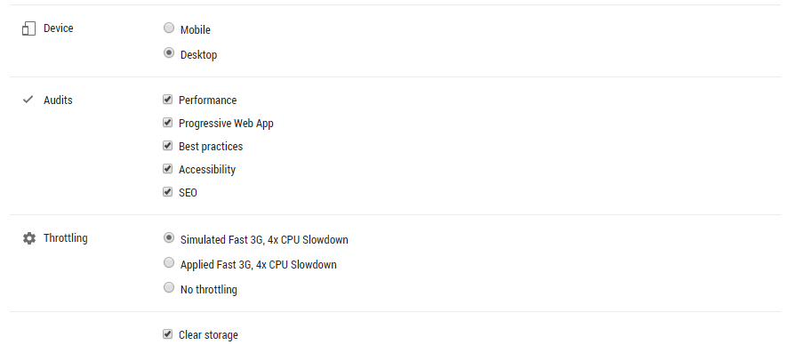
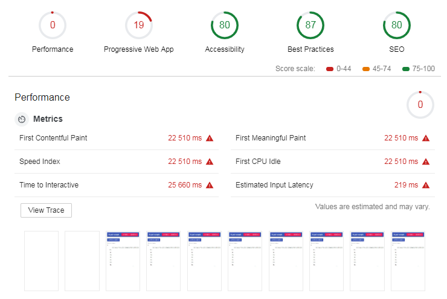
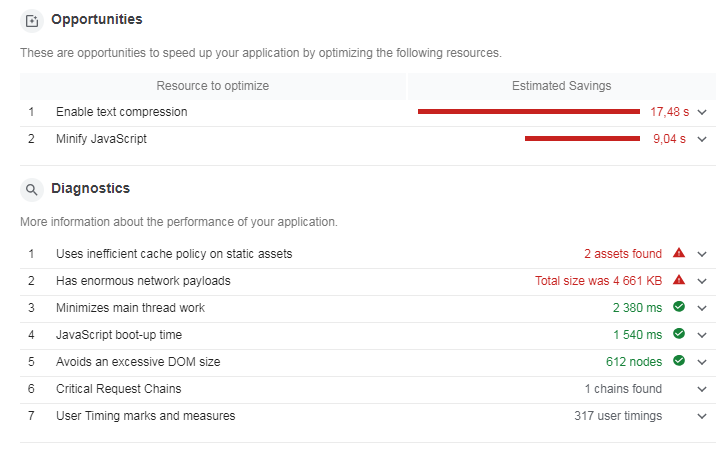
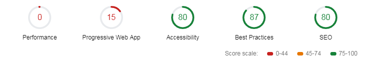
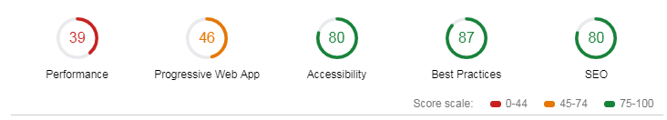
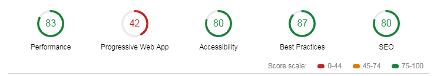
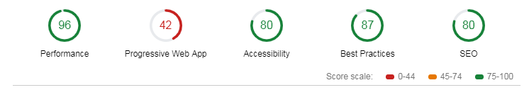
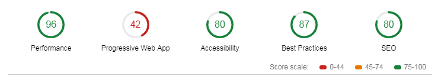

# Web application performance audits and optimization

## Firstly we'll make an audit of our current application without any optimizations with chrome dev-tools and lighthouse.




Results:


Recommendations:



### Bundle compilation

We have to build our application bundle and use it instead of development environment bundle:

```sh
npm run build
```

Then we have to serve our application somehow. Our bundle now is a bunch of .html and .js files in `dist` directory. We have to serve them with web server (no webpack-dev-server now).

```sh
npm i serve -g
cd dist
serve -s
```

Now let's take another audit run:



Something wrong with this


We just built and served our develop bundle but only with another web server.


```sh
npm run prod
```




Ah, some progress. 


### Compression

Our `serve` web-server could not help us with data compression, so we have to adopt a little bit more serious approach:

```sh
nginx -c "nginx.conf"
```

Aaaand



Yeah, 83 percents on performance. Nice.


### Caching

```
http {
    server {
        gzip        on;
        gzip_comp_level 7;
        gzip_types    text/plain application/javascript application/x-javascript text/javascript text/xml text/css;

        listen      5000;
        root        ./dist;
        location / {
            expires 1y;
            try_files $uri $uri/ /index.html;
        }
    }
}

```




### Accessibility section

```javascript
const AdaptedTextField = ({input: {value, onChange}, ...custom}) => (
    <TextField
        value={value}
        onChange={onChange}
        inputProps={{label: custom.label}}  // set label attribute on html <input> tag
        {...custom}
    />
);
```




## Back to performance

### Generate self-signed SSL certificate

```sh
cd ~/nginx/ssl
openssl req -x509 -nodes -days 365 -newkey rsa:4086 -nodes -keyout domain.key -out domain.crt
openssl dhparam -out dhparam.pem 4096

```


